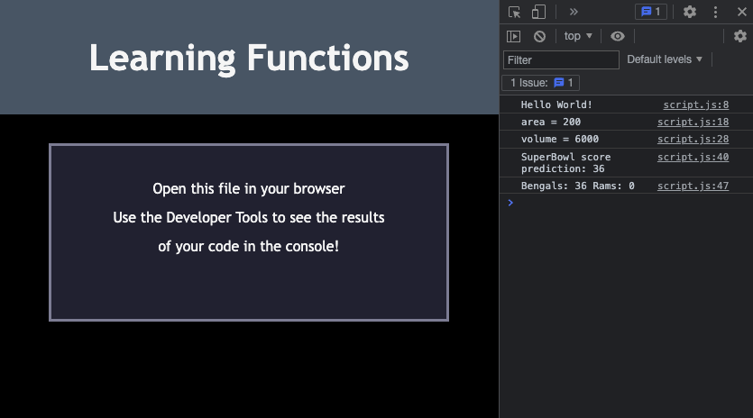

# 🏗️ Practice Writing Functions

Work with your breakout group to implement the following user stories:

1. As a developer, I want to write a function that logs ```'Hello World!'``` to the console.

2. As a developer, I want to write a function that accepts two parameters of ```height``` and ```width```, and returns the ```product```, which equals the ```area```.

3. As a developer, I want to write a function that accepts three parameters of ```length```, ```width``` and ```height```, and returns the ```product```, which equals the ```volume```.

4. As a developer, I want to write a function to predict the score of the Super Bowl game. This function should take in four parameters of ```touchdown, extra point, two point conversion``` and ```field goal```, and return the total of all four parameters.

## Acceptance Criteria

1. It's done when ```'Hello World!'``` is logged to the console

2. It's done when the function takes ```parameters``` of ```10``` and ```20```, and returns ```200``` as the area.

3. It's done when the function takes ```parameters``` of ```10, 20,``` and ```30```, and returns ```6000``` as the volume.

4. It's done when the function takes ```parameters``` of ```3, 3, 0, 5``` and returns ```36```

### 🏆 Bonus

* Use the Super Bowl Score function to predict the score for each team, and console log a Final Score prediction.

## Screenshot of Console when Solved



## 💡 Hints

Use [Google](https://www.google.com) or another search engine to research this.

If you have completed this activity, work through the following challenge with your group to further your knowledge:

* What is hoisting?

---
